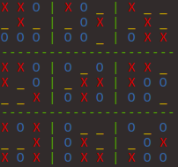

# MonteCarloTreeSearch

## Description



Ultimate Tic Tac Toe bot which uses Monte Carlo Tree Search to find the optimal move. The code also contains classes for a random player and human player, for easier testing and simulations. In computer science, Monte Carlo tree search (MCTS) is a heuristic search algorithm for some kinds of decision processes, most notably those employed in software that plays board games. In that context MCTS is used to solve the game tree.

MCTS was introduced in 2006 for computer Go. It has been used in other board games like chess and shogi, games with incomplete information such as bridge and poker, as well as in turn-based-strategy video games (such as Total War: Rome II's implementation in the high level campaign AI). 

## To Run

```bash
bar@foo:~/MonteCarloTreeSearch$ python3 src/play.py
```

## External Library

* Colorama

## Author

* Vaibhav Garg